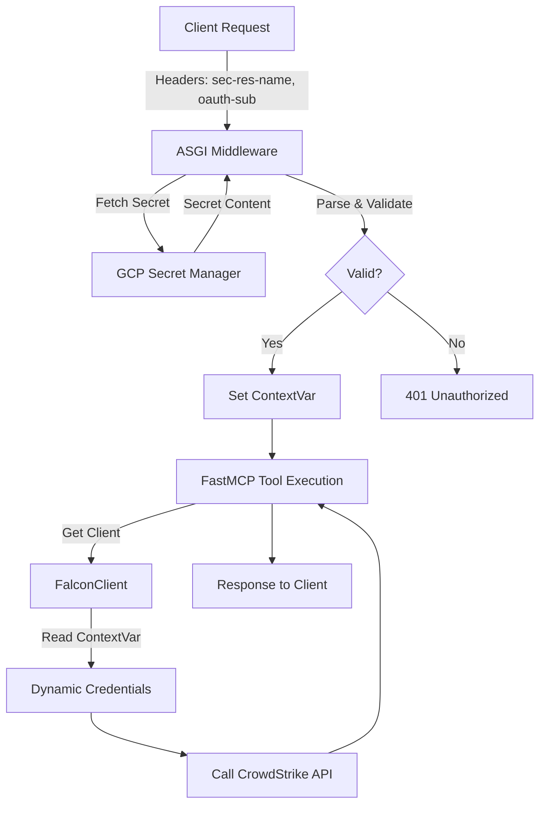

# Falcon MCP: SaaS Multi-Tenant Mode Summary

We have implemented a **SaaS Multi-Tenant Mode** for the Falcon MCP server. This mode allows the server to start without hardcoded static credentials and dynamically authenticate each request using secrets fetched from Google Cloud Secret Manager.

---

## 🚀 How It Works (The Wiring)

The flow relies on standard ASGI middleware and Python's `contextvars` to ensure thread-safe, request-scoped credential management.



### Request Flow Step-by-Step

1.  **Request Arrival**: A client sends a JSON-RPC request over HTTP/SSE. The request must include headers:
    *   `sec-res-name` (GCP Secret Resource Name)
    *   `oauth-sub` (Client ID to validate)
2.  **Intercept (Middleware)**: The `saas_middleware` intercepts the request.
3.  **Dynamic Fetch**: It fetches the secret from Google Cloud Secret Manager using the resource name from the header.
4.  **Parse & Match**: It parses the secret (format: `OAUTH_SUB=CLIENT_ID=CLIENT_SECRET=BASE_URL`) and ensures the `OAUTH_SUB` matches the header to prevent spoofing.
5.  **Set Context**: It stores these credentials in a python `ContextVar` (`falcon_credentials_var`). This is scoped tightly to this specific request task.
6.  **Tool Execution**: FastMCP routes the request to the tool handler.
7.  **Dynamic Client**: When the tool accesses the `FalconClient`, it checks if SaaS mode is enabled. If so, it dynamically instantiates the underlying API harness using the credentials from the `ContextVar`.
8.  **Execution**: The tool executes using the tenant's specific credentials.

---

## 🛠️ Key Changes Made

### 1. Model Extension
-   **`pyproject.toml`**: Added `google-cloud-secret-manager` dependency.

### 2. Core Logic
-   **`falcon_mcp/common/saas.py` (New)**:
    -   Defines `falcon_credentials_var` (ContextVar).
    -   Implements `get_secret_val` (GCP fetch) and `parse_and_validate_secret`.
-   **`falcon_mcp/common/auth.py`**:
    -   Implements `saas_middleware` for request interception.
-   **`falcon_mcp/client.py`**:
    -   Modified `FalconClient` to be context-aware (resolves credentials dynamically from `falcon_credentials_var` when in SaaS mode).
-   **`falcon_mcp/server.py`**:
    -   Modified to skip startup authentication checks when `FALCON_MCP_SAAS` is enabled.
    -   Enforces `stateless_http=True` for SaaS mode.
    -   Registers the `saas_middleware` if SaaS mode is enabled.

### 3. Testing and Verification
-   **`tests/test_saas.py` (New)**: Unit tests for middleware and secret resolution.
-   **Standard Tests Fixes**: Made mock checks robust to enable standard unit tests to pass cleanly alongside the new mode.

---

## ⚡ Optimizations (Caching)

To make SaaS mode highly efficient and reduce latency, we implemented two layers of caching:

### 1. Secret Caching (GCP Lookups)
-   **What**: Caches the secret string fetched from GCP Secret Manager.
-   **Why**: Prevents hitting the GCP Secret Manager API on every request.
-   **How**: Scoped with a 5-minute TTL using a simple dictionary in `saas.py`.

### 2. Client Caching (CrowdStrike OAuth Tokens)
-   **What**: Reuses the `APIHarnessV2` (FalconPy) instance per tenant.
-   **Why**: Reuses the OAuth2 token across multiple requests, avoiding the ~1s authentication delay for subsequent calls.
-   **How**: Keyed by `sec_res_name` in a global dictionary in `client.py`. Auto-re-logs in if the token expires.

---

## 🌉 ADK A2A Gateway Agent

Since standard A2A clients expect to send `Bearer` tokens (JWT) rather than raw tenant headers, we built an **A2A Gateway Agent** using the ADK.

-   **Location**: `examples/adk/falcon_a2a_agent`
-   **Role**: 
    1. Intercepts incoming requests with standard `Authorization: Bearer` tokens.
    2. Decodes the token to find the `sub` (or tenant identifier).
    3. Overrides the `MCPToolset` connection parameters via `before_agent_setup` callback to inject `sec-res-name` and `oauth-sub` headers dynamically.
    4. Routes the tool calls to the backend `falcon-mcp` SaaS server.

---

## 📖 How to Enable and Run

### 1. Run the Core MCP Server in SaaS Mode

Set `FALCON_MCP_SAAS=Y` in your environment. Run using an HTTP-based transport.

```bash
export FALCON_MCP_SAAS=Y
uv run falcon-mcp --transport streamable-http
```

### 2. Run the A2A Gateway Agent

Navigate to the agent directory and run the uvicorn app:

```bash
cd examples/adk/falcon_a2a_agent
uv run uvicorn agent:a2a_app --port 8001
```

See `README.md` and test clients (`test_a2a_client.py`) for more details on usage.
